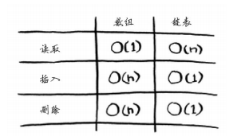
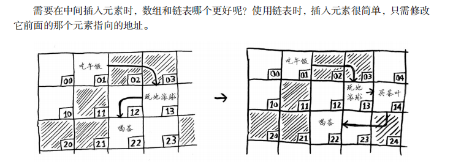

# **线性表**的**链式**储存结构——**链表**（Linked-List）


## 顺序储存结构&链式储存结构

### 介绍

- **顺序储存结构**：

相邻两个元素<u>不仅逻辑上是相邻的</u>，而且<u>物理的储存单元也是相邻</u>的。

如数组，需要随机访问元素时，可以迅速找到数组的任何元素，无需通过访问其他元素来访问目标。

- **链式储存结构**：

<u>逻辑上相邻的两个元素，物理的储存单元未必相</u>邻。逻辑上相邻的元素的关系是通过指针来表示的。

相比数组，在链表中，元素在物理上并非相邻，需要先访问前面的元素，要访问目标元素必须先访问第一个元素得到第二个元素的地址，再访问第二个元素得到第三个元素的地址......直到访问到目标元素。

单链表节点结构描述:

```c++
template <class T>
typedef struct ListNode* List_address;//List_address定义为结构体指针
//创建结构体，包含数据和索引，用于指向下一个节点的位置
//线性表的链式存储实现，不要求逻辑上相邻的两个元素物理上也相邻
struct ListNode {  
    T value;
    List_address next;
};  
```


常见的数组和链表操作运行时间[^图片取自《算法图解》]：



虽然查询时，数组较为方便快捷，但如果要在数组中插入或者删除元素就相当麻烦了。

## 查：

链表中查询元素，需要遍历链表，直到查到元素或者遍历到链表尾部。

### **返回链表长度:**

```c++
int Length(List_address head) {
	List_address p = head;//p指向表的第一个节点
	int cnt = 0;//用来记录表长
	while (p) {//p为空则退出循环，否则继续
		p = p->next;//p指向当前节点记录的下一个节点的地址
		cnt++;
	}
	return cnt;//直到最后一个节点的后继为空，退出循环，返回表长
}
```


### **根据位序i查找元素:**

```c++
template <class T>
List_address elementFind_of_index(T i, List_address head) {
	List_address p = head;//p指向表的第一个节点
	int cnt = 1;//用来记录当前位序
	while (p != NULL && cnt < i) {
		p = p->next;//p指向当前节点记录的下一个节点的地址
		cnt++;
	}
	if (cnt == num) {
		return p;
	}//直到最后一个节点的后继为空或者找到位序为num的元素，退出循环，返回表长
	else {
		return NULL;//遍历到最后一个节点也没找到位序i
	}
}
```

### **根据元素data_search查询位序:**

```c++
template <class T>
List_address indexFind_of_element( T data_search, List_address head) {
	List_address p = head;//p指向表的第一个节点
	while (p != nullptr && p->data != data_search) {//p不为空且没有查到元素则继续
		p = p->next;//p指向当前节点记录的下一个节点的地址
	}
    if(p == nullptr){
    printf("未找到data_search");
        return nullptr;
    }
    else{
    return p;
    }
}
```

## **增:**

### **在位置i处插入元素：**

```c++
List_address Insert(ListNode x, int i, List_address head) {
	//先申请一块空间s,大小储存next和data，即单独创立一个节点s,但暂时没有接入链表中
	//要接入位置i,逻辑上为s的前缀是与节点i-1链接,后继与节点i链接
	//步骤1:创建节点s
	List_address p, s;
	//判断位置i是否为首地址,如果为首地址则没有节点i-1，只需将s的next指向head就行
	if (i == 1) {
		s = new(ListNode);
		s->data = x->data;
		s->next = head;
		return s;
	}
	//步骤2:找到节点i，用节点s的next指向节点i
	//步骤3:找到节点i-1,用节点i-1的next指向节点s
	p = elementFind_of_index(i - 1, head);
	if (p == NULL) {
		printf("参数i错误");
		return NULL;
	}
	else {
		s = new(List);
		s->data = x;
		s->next = p->next;
		p->next = s;
		printf("插入成功");
		return head;
	}
	//完成插入
	//ps:步骤2和步骤3不可以对调，如果先修改节点i-1的next指向s，那么无法再找到节点i的位置
	//整个结果变为，在位置i-1截断链表,再接入位置s，丢失链表i以后的部分

}
```

如图:[^图片取自《算法图解》]



### **头插入：**

```c++
void insertAtHead(const T& value,List_address *head) {  
     List_address<T> newNode = new ListNode<T>{value, head};   
    if(head == nullptr){
          head = newNode;
     }
    else{
    List_address<T> newNode = new ListNode<T>{value, head};  
        head = newNode;  
        printf("插入成功");
    }
    }  
```


### **尾插入：**

```c++
 void insertAtTail(const T& value,List_address head) {  
        List_address<T> newNode = new ListNode<T>{value, nullptr};  
        if (head == nullptr) {  //
            head = newNode;  
        } else {  
            List_address<T> current = head;  //遍历到尾部
            while (current->next != nullptr) {  
                current = current->next;  
            }  
            current->next = newNode;  
        }  
```

## **删：**

### **删除指定位序i的元素:**

```c++
void Delete(int i, List_address *head) {
	List_address temp, i_pre;//temp用于存储要删除的节点，i_prev用于存储前一个节点
	//判断i是否为1
	if (i == 1) {
        temp = head;
        if(temp != nullptr){//判断链表是否为空
		head = head->next;//删除 第一个节点后，头指针变为第二个节点的位置
        printf("删除成功");
		free(temp);//从链表中删除还要释放空间
        }else{
            printf("链表为空");
        }
	}
	
    i_prev = elementFind_of_index(i - 1, *head); //应用根据位序i查找元素地址 
    // 检查是否找到了前一个节点以及链表是否足够长  
    if (i_prev == NULL || i_prev->next == NULL) {  
        printf("参数i错误");  
    } else {  
        temp = i_prev->next; // temp 现在是要删除的节点  
        i_prev->next = temp->next; // 绕过要删除的节点  
        printf("删除成功\n");  
        free(temp); // 释放要删除的节点的空间  
    }  

}
```

## 改:

### 修改指定位序的元素:

```c++
```

